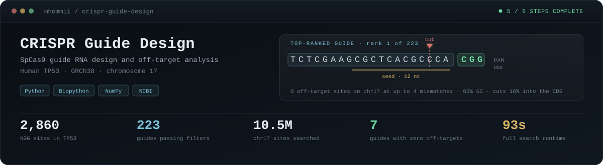
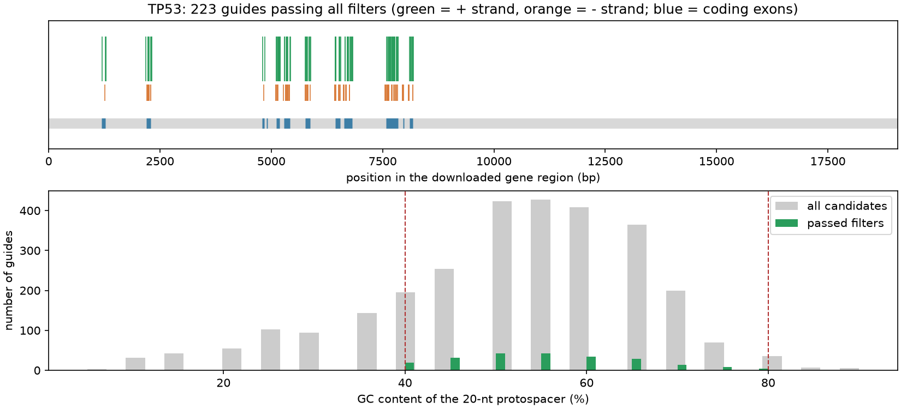
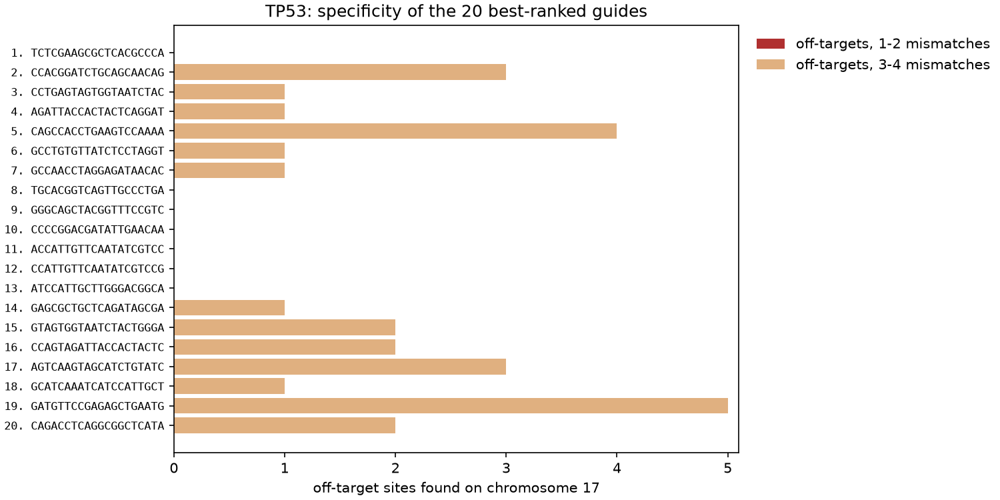

<div align="center">



<br>


**Designing SpCas9 guide RNAs for a human cancer gene — and checking where else they might cut.**

</div>

> [!NOTE]
> **How this was made.** A guided learning project built and run with Claude Code (an AI assistant), which wrote the code and explanations and executed each step. It is a learning exercise, not independent research. The *My notes* sections are mine to fill in as I work through the code.

---

## The problem in one picture

A guide RNA is only 20 bases long, and Cas9 tolerates mismatches. So a guide meant for TP53 may bind a similar sequence elsewhere in the genome and cut there instead. **Designing a guide is easy; showing that it is specific is the actual work.**


---

## Results at a glance

<table>
<tr>
<td width="25%" align="center"><h3>2,860</h3>NGG sites found<br><sub>1,391 (+) · 1,469 (−)</sub></td>
<td width="25%" align="center"><h3>223</h3>passed all filters<br><sub>from 280 in coding exons</sub></td>
<td width="25%" align="center"><h3>10,495,968</h3>chr17 sites searched<br><sub>both strands, ≤4 mismatches</sub></td>
<td width="25%" align="center"><h3>93 s</h3>full search runtime<br><sub>on a 6&nbsp;GB laptop</sub></td>
</tr>
</table>

### Top-ranked guide

```text
   5'- T C T C G A A G C G C T C A C G C C C A | C G G -3'
       └──────────── protospacer (20 nt) ─────┘  └ PAM ┘
                       └──── seed (12 nt) ─────┘
                                      ▲
                                   cut site
```

| Property | Value |
|---|---|
| Protospacer | `TCTCGAAGCGCTCACGCCCA` |
| PAM | `CGG` (+ strand) |
| GC content | 65% |
| Cut position | 16% into the coding sequence |
| Off-targets on chr17 (≤4 mismatches) | **0** |

Of the 223 guides, **205 have no off-target at 1–2 mismatches** and **7 have none at all** up to 4 mismatches.

Full table → [`results/top_guides.md`](results/top_guides.md) · all 223 ranked → [`results/ranked_guides.tsv`](results/ranked_guides.tsv)

---

## Where the guides land



Guides cluster exactly on the coding exons (blue) — the coding-exon filter doing its job. The lower panel shows the GC filter cutting the tails off the distribution.



The 20 best-ranked guides. Nothing appears in the 1–2 mismatch band, which is what you want; the pale bars are distant 3–4 mismatch sites.

---

## The bug that made this worth doing

<table><tr><td>

Step 4 has a self-check: every guide came from TP53, which is on chromosome 17, so **every guide must find itself** when searching that chromosome.

It failed. **154 of 223 guides could not find their own target site.**

The cause was one character — a `+ 1` in the PAM indexing:

```python
# wrong: shifts every protospacer one base along the chromosome
pam_starts = np.flatnonzero(is_g[1:-1] & is_g[2:]) + 1

# right: flatnonzero already returns the PAM start
pam_starts = np.flatnonzero(is_g[1:-1] & is_g[2:])
```

Without that check the pipeline would have produced a full, confident, completely wrong off-target table — every guide compared against sequences shifted by one base. Nothing would have looked broken.

</td></tr></table>

> [!IMPORTANT]
> This is why the *Checks* section below exists, and why every step that can verify itself does.

---

## Checks

```powershell
.venv\Scripts\python.exe tests\test_pam_logic.py          # PAM finding, both strands
.venv\Scripts\python.exe tests\test_mismatch_counting.py  # packed mismatch counting
```

| Check | What it proves |
|---|---|
| Hand-worked PAM cases | `AGG` at index 0, overlapping `GGG`, reverse-strand `CCN`, too-close-to-start rejection |
| 20,000 random sequence pairs | The fast bit-packed comparison agrees exactly with plain base-by-base counting |
| Reverse-complement identity | `3 − code` really is the complement for the A=0,C=1,G=2,T=3 encoding |
| Self-recovery (step 4, runtime) | All 223 guides find their own target site on chr17 — stops the run if not |
| Coordinate spot-check | The top guide sits at its recorded coordinates with a valid `CGG` PAM |

---

<details>
<summary><b>How the off-target search runs 2.3 billion comparisons in 93 seconds</b></summary>

<br>

The obvious approach — compare each guide to each site, base by base — is 223 guides × 10.5M sites × 20 bases ≈ **47 billion character comparisons**. In Python that is hours.

Instead each base becomes 2 bits (`A=00, C=01, G=10, T=11`), so a 20-base protospacer packs into a single 40-bit integer:

```text
  A  C  G  T  A  C ...          guide   →  0b00_01_10_11_00_01...
  A  C  G  A  A  C ...          site    →  0b00_01_10_00_00_01...
                                XOR     →  0b00_00_00_11_00_00...
                                            differing pair ─┘
```

Comparing a guide to a site is then one XOR. Folding each 2-bit pair down to a single bit and counting set bits gives the mismatch count:

```python
difference = site_packed ^ encode(protospacer)          # whole array at once
folded     = (difference | (difference >> 1)) & 0x5555555555555555
mismatches = np.bitwise_count(folded)                   # numpy ≥ 2.0
```

NumPy applies that to all 10.5 million sites in one vectorised call — about 0.4 s per guide. The seed region is the low 24 bits, so `folded & 0xFFFFFF` gives seed mismatches for free.

This is exactly what `tests/test_mismatch_counting.py` validates against the slow, obviously-correct version.

</details>

<details>
<summary><b>Why Cas-OFFinder was not used, and what was done instead</b></summary>

<br>

[Cas-OFFinder](https://github.com/snugel/cas-offinder) (Bae et al. 2014) is the standard tool for this and would normally be the right choice. It requires an OpenCL runtime, and this machine has none registered:

```text
$ cas-offinder input.txt C output.tsv
No OpenCL devices found.
```

Rather than skip the step, the same mismatch search is implemented directly in step 4. It is **exhaustive** over chr17 — every NGG site on both strands against every guide — so it is not an approximation of Cas-OFFinder's results, just a hand-written version of the same idea without bulge support.

Step 4 still writes [`results/cas_offinder_input.txt`](results/cas_offinder_input.txt), so the search can be reproduced with the real tool on a machine that has OpenCL.

</details>

<details>
<summary><b>What the filters do, and why on-target scoring is deliberately absent</b></summary>

<br>

| Filter | Keeps | Removes | Why |
|---|---|---|---|
| In a coding exon | 280 | 2,580 | A knockout needs to disrupt protein-coding sequence |
| GC 40–80% | 2,377 | 483 | Low GC binds weakly; high GC increases off-target binding |
| No `TTTT` | 2,622 | 238 | Four T's terminate RNA polymerase III, truncating the guide |
| No run of 5+ | 2,480 | 380 | Long homopolymers cause synthesis errors and poorer activity |
| **All combined** | **223** | 2,637 | |

**On-target activity is not predicted here.** How *well* a guide cuts needs a model trained on large screens — Rule Set 2 (Doench et al. 2016), which is what CRISPick uses. The published specificity scores (MIT, CFD) likewise depend on experimentally measured mismatch penalty matrices.

Reimplementing either from memory would produce numbers that look authoritative and are not. So this project ranks on what it actually measured — off-target counts, seed integrity, cut position — and the weights are written out explicitly in `steps/05_rank_and_report.py` for anyone to disagree with.

</details>

---

## Pipeline

| Step | Script | Does |
|:--:|---|---|
| 1 | [`01_fetch_gene.py`](steps/01_fetch_gene.py) | Downloads the gene's GRCh38 region and exon annotation from NCBI |
| 2 | [`02_find_pam_sites.py`](steps/02_find_pam_sites.py) | Finds every 20-nt protospacer next to an NGG PAM, both strands |
| 3 | [`03_filter_guides.py`](steps/03_filter_guides.py) | GC content, TTTT terminator, homopolymers, coding-exon overlap |
| 4 | [`04_off_target_search.py`](steps/04_off_target_search.py) | Searches chr17 for sites the guide could also cut |
| 5 | [`05_rank_and_report.py`](steps/05_rank_and_report.py) | Ranks by specificity and cut position, writes the report |

## Running it

```powershell
py -m venv .venv
.venv\Scripts\python.exe -m pip install -r requirements.txt
$env:NCBI_EMAIL = "you@example.com"   # NCBI requires a contact address

.venv\Scripts\python.exe steps\01_fetch_gene.py
.venv\Scripts\python.exe steps\02_find_pam_sites.py
.venv\Scripts\python.exe steps\03_filter_guides.py
```

Step 4 needs the reference chromosome (~25 MB download, 81 MB unpacked) in `data/`:

```powershell
# https://hgdownload.soe.ucsc.edu/goldenPath/hg38/chromosomes/chr17.fa.gz
.venv\Scripts\python.exe steps\04_off_target_search.py   # ~90 s
.venv\Scripts\python.exe steps\05_rank_and_report.py
```

Target a different gene by changing `gene` in `config.toml` — note that step 4's reference chromosome must be the one that gene sits on.

---

## My notes

*(to be written by me)*

### Step 1 — fetching the gene

### Step 2 — PAM sites

### Step 3 — filters

### Step 4 — off-targets

### Step 5 — ranking

---

## Limitations

> [!WARNING]
> These matter, and the numbers above should not be read without them.

- **Learning project.** The guides are **not experimentally validated** and are not recommendations for any therapeutic use.
- **On-target activity is not predicted**, and the published MIT/CFD specificity scores are not reproduced. See the collapsible section above for why.
- **One chromosome, not the genome.** Off-target search covers chr17 (~2.7% of the genome). A guide that looks clean here has not been checked against the other 97%.
- **No bulges.** Only mismatches are searched, not insertions or deletions between guide and DNA.
- **Annotation-dependent.** "Coding exon" means the union of all annotated CDS features in the RefSeq record, so a guide in a rarely-used exon is treated like one in a constitutive exon.

---

## References

| Source | |
|---|---|
| Cock, P. J. A. et al. (2009) | Biopython: freely available Python tools for computational molecular biology and bioinformatics. *Bioinformatics*. [10.1093/bioinformatics/btp163](https://doi.org/10.1093/bioinformatics/btp163) |
| Bae, S., Park, J. & Kim, J.-S. (2014) | Cas-OFFinder: a fast and versatile algorithm that searches for potential off-target sites of Cas9 RNA-guided endonucleases. *Bioinformatics*. [10.1093/bioinformatics/btu048](https://doi.org/10.1093/bioinformatics/btu048) · [repo](https://github.com/snugel/cas-offinder) |
| Doench, J. G. et al. (2016) | Optimized sgRNA design to maximize activity and minimize off-target effects of CRISPR-Cas9. *Nature Biotechnology*. [10.1038/nbt.3437](https://doi.org/10.1038/nbt.3437) |
| Sanson, K. R. et al. (2018) | Optimized libraries for CRISPR-Cas9 genetic screens with multiple modalities. *Nature Communications*. [10.1038/s41467-018-07901-8](https://doi.org/10.1038/s41467-018-07901-8) |
| CRISPick | Broad Institute Genetic Perturbation Platform — [web tool](https://portals.broadinstitute.org/gppx/crispick/public) |
| Sequence data | [NCBI Gene and RefSeq](https://www.ncbi.nlm.nih.gov/gene/) · reference chromosome from [UCSC hg38](https://hgdownload.soe.ucsc.edu/goldenPath/hg38/chromosomes/) |

<div align="center">
<sub>

Part of a bioinformatics portfolio → [roadmap](https://github.com/mhommii/bioinformatics-roadmap) · [cancer-crispr-targets](https://github.com/mhommii/cancer-crispr-targets) · [variant-calling-pipeline](https://github.com/mhommii/variant-calling-pipeline)

</sub>
</div>
